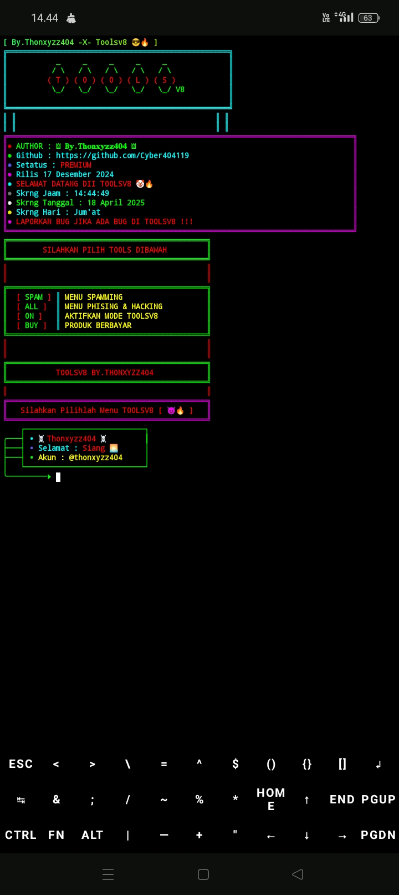
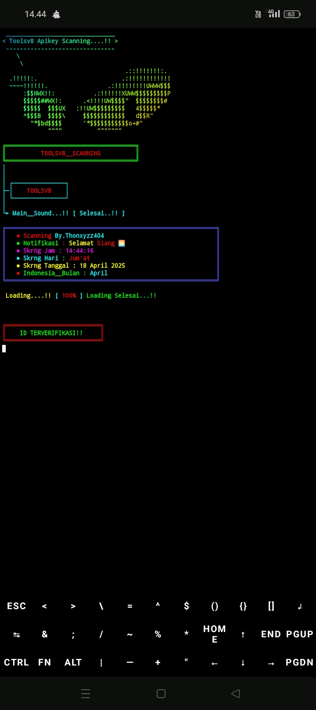

# TOOLS V8

Repository ini berisi koleksi alat dan skrip untuk Termux...!!

### Screenshot [1]



### Screenshot [2]



## Termux Instalasi 🖥️📡

Untuk menggunakan alat-alat ini, ikuti langkah-langkah instalasi di bawah ini di Termux:

```bash
git clone https://github.com/Krocoo4578/Goblok.git
cd Goblok 
bash Cok.sh
